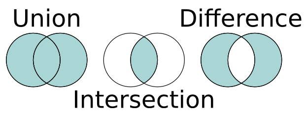
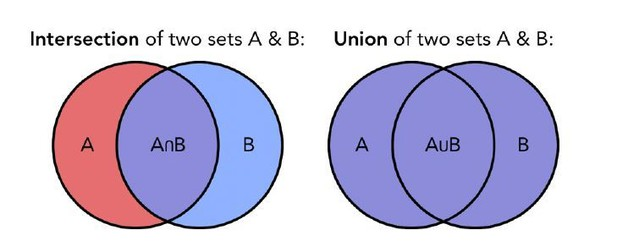

# Table of Contents
- [Introduction](#Introduction)
- [Diagrams](#Diagrams)
- [Set Example Problem](#Set-Example-Problem)
- [Set Problem for you to solve](#Set-Problem-for-you-to-solve)

## What is a Set
A set is a data structure that allows you to save multiple items as a variable. A set has items that are unordered, without duplicates, and immutable. Sets allow you to add or remove items, but you are unable to change items. Sets can contain items of different types as well.


## Purpose of a Set
Sets are used to store items you do not want duplicates of, this can be useful when you are developing a variable that should never allow duplicates. Sets are faster than list, but are unordered. See the Code example to view all of the build in
in functions that can be used with sets. 


## Set Performance

- .add(value) => O(1)
- .remove(value) => O(1)
- .union O(1)
- .intersection O(1)
- .difference O(n)
- accessing a set element O(n)

## Problems that can be solved with a Set
Sets can be used to solve problems that only need unique values. Sets are also useful when speed is essential in solving problems that list are too slow for.


## Common errors in Sets
A common problem some people face when using sets, is not understanding the rules. Before you decide to use the set data type, make sure that you understand them clearly and that sets do not allow duplicate items.


# Diagrams



Sets example with Union and Intersection symbols. These symbols are commonly used and are good to know.



# Set Example Problem

John has a lot of friends, but he struggles to see what is unique about himself. Create a program with sets that will build Johns self esteem by telling him all of the unique traits he has.

 ```python
John_Traits = {'Low Self Esteem', 'Loyal', 'Friendly', 'Loving', 21, 'Thrifty', "Clean", "Giving", "Thoughtful"}
Friend1_Traits = {'High Self Esteem', 'Angry', 'Cunning', 'Awesome', 21, 'Thrifty', "Cool"}
Friend2_Traits = {'Low Self Esteem', 'Friendly', 'Loving', 21, 'Thrifty', "Clean"}

```
[Solution](SetExampleProblem.py)

#Problem 2
John has friends that want to see what traits they have in common with them. Create a program with sets that shows his friends what they have in common with John.s

 ```python
John_Traits = {'Low Self Esteem', 'Loyal', 'Friendly', 'Loving', 21, 'Thrifty', "Clean", "Giving", "Thoughtful"}
Friend1_Traits = {'High Self Esteem', 'Angry', 'Cunning', 'Awesome', 21, 'Thrifty', "Cool"}
Friend2_Traits = {'Low Self Esteem', 'Friendly', 'Loving', 21, 'Thrifty', "Clean"}

```
[Solution](SetExampleProblem2.py)
# Set Problem for you to solve

Greg has encountered a bully named Todd. Todd wants Greg to tell him blackmail material about a friend. Help Greg make a good decision and keep quiet by using sets to show all of the traits Greg has that Todd doesn't.
 ```python

Greg_Traits = {'Nice', 'Loyal', 'Friendly', 'Cool', 19, 'smart'}
Todd_Traits = {'Manipulative', 'Evil', 19, 'cunning'}
```