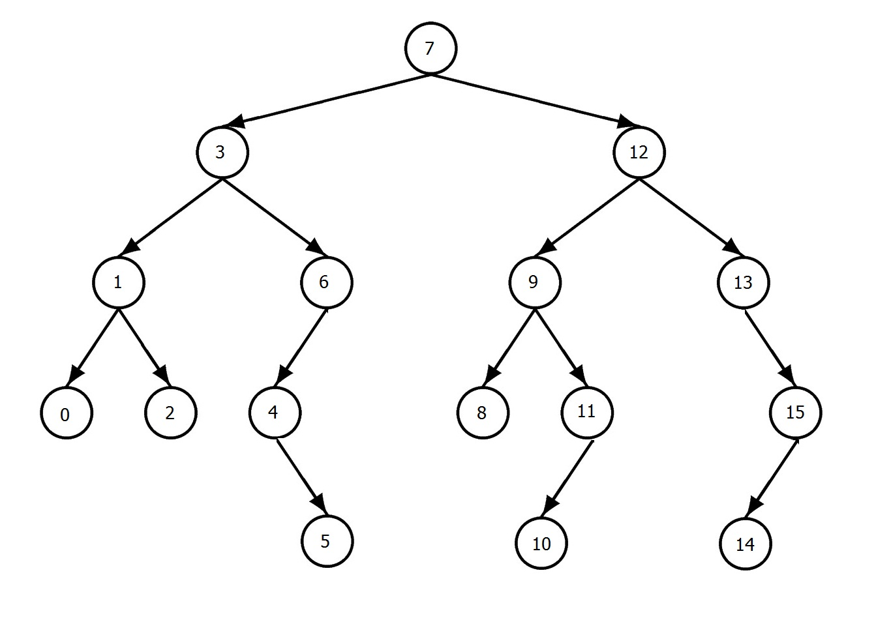
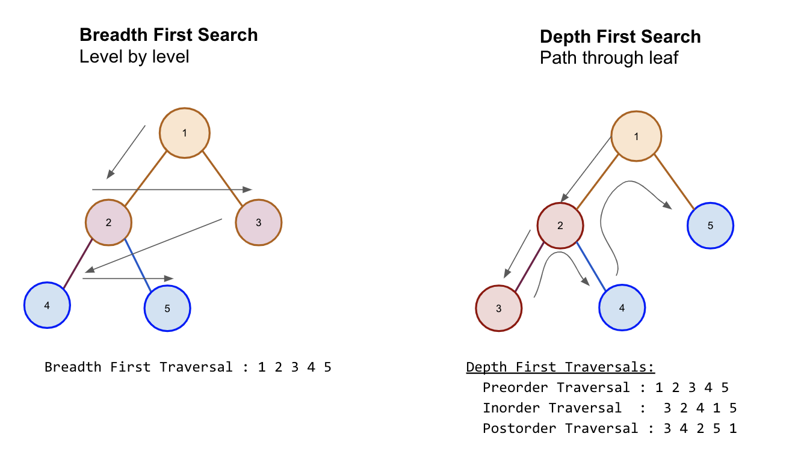

# Table of Contents
- [Introduction](#Introduction)
- [Diagrams](#Diagrams)
- [Binary Tree Example Problem](#Binary-Tree-Example-Problem)
- [Binary Tree Problem for you to solve](#Binary-Tree-Problem-for-you-to-solve)

## What is a Binary Tree
A Binary Tree is a collections of nodes where each parent node has zero, one, or two children. A balanced binary tree with two children have the greater child on the right and the lesser child on the left. For example, a tree with a parent node of 10 would have a child of 2 on the left and a child of 11 on the right. Check out the [Diagrams](#Diagrams) for a visual.

- The Root Node is the node at the top of the tree
- The Parent Node is a node with children nodes
- The Child Node is a node with a parent
- The Leaf Node is a node without any children nodes
 

## Purpose of a Binary Tree

## Problems that can be solved with a Binary Tree

## How Binary Trees are used in Python

## Common errors in Binary Trees

# Diagrams

# Binary Tree Example Problem

# Binary Tree Problem for you to solve
Use the [Tree.py](Tree.py) file and implement your solution.
