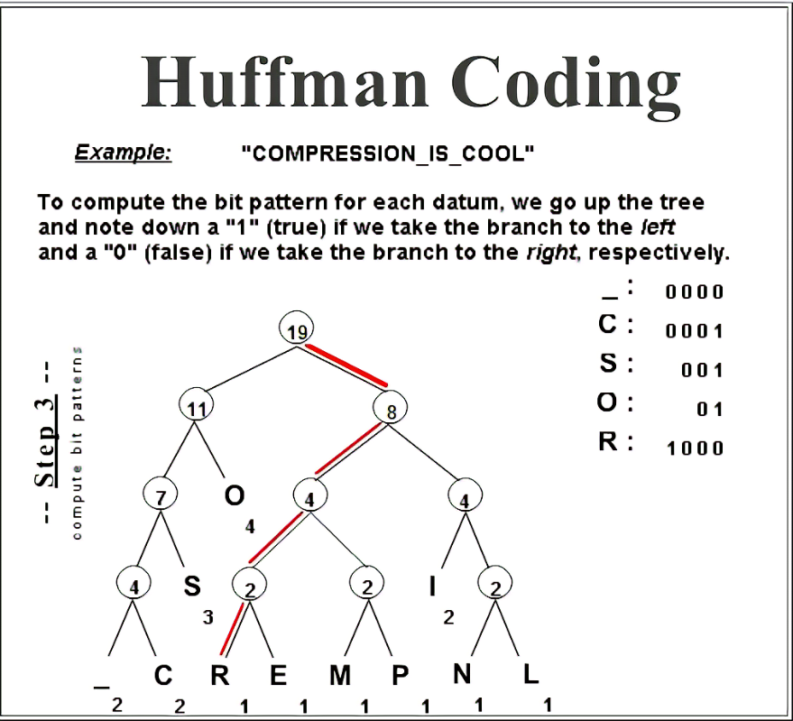

# Table of Contents
- [Introduction](#Introduction)
- [Diagrams](#Diagrams)
- [Binary Tree Example Problem](#Binary-Tree-Example-Problem)
- [Binary Tree Problem for you to solve](#Binary-Tree-Problem-for-you-to-solve)

## What is a Binary Tree
A Binary Tree is a collections of nodes where each parent node has zero, one, or two children. A balanced binary tree with two children have the greater child on the right and the lesser child on the left. For example, a tree with a parent node of 10 would have a child of 2 on the left and a child of 11 on the right. Check out the [Diagrams](#Diagrams) for a visual. Binary trees are commonly traversed through depth first search or breadth first search.

- The Root Node is the node at the top of the tree
- The Parent Node is a node with children nodes
- The Child Node is a node with a parent
- The Leaf Node is a node without any children nodes
 

## Purpose of a Binary Tree
Binary Trees are great way to store data in a hierchy. Binary Trees are often used for sorting, data compression, and other purposes. 

## Problems that can be solved with a Binary Tree
Any problem that requires a sorted heirchy could consider using a binary tree. Binary Tree is used in Huffman code, which is a compression algorithem that creates lossless compression. Huffman code uses a binary tree with routes to different letters and symbols to save space by looking for patterns and compressing them. If you would like to learn more about Huffman code check out this website .

## How Binary Trees are used in Python

## Common errors in Binary Trees

# Diagrams

### Basic Binary Search tree
Root Node: 7

Parent-child node relationships: 
- 7 has children 3 and 12
- 3 has children of 1 and 6
- 1 has children of 0 and 2
- 6 has 4 as a child
- 4 has 5 as a child
- 12 has children 9 and 13
- 9 has children 8 and 11
- 11 has 10 as a child
- 13 has 15 as as a child
- 15 has 14 as a child

Leaf Nodes: 0,2,5,8,10,14(Nodes without Children)

### Binary Tree Common Search methods

Breadth first search checks the nodes closest to the root node first from left to right. Depth First Search searches for values starting at the root moving down each child as deep as possible from left to right. 

# Binary Tree Example Problem

# Binary Tree Problem for you to solve
Use the [Tree.py](Tree.py) file and implement your solution.
