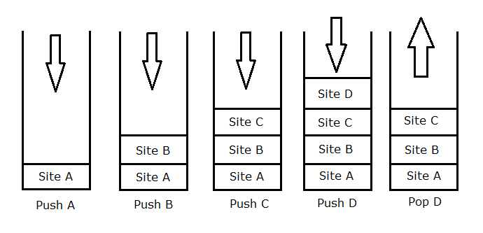

# Table of Contents
-[Introduction](#Introduction)
-[Diagrams](#Diagrams)
-[Stack Example Problem](#Example)
-[Stack Problem](#Problem)

A Stack is a data structure that is Last In First Out. This means whatever is on top of the stack will be the first item removed when pop() is used. 

## Purpose of a Stack

A stack is used whenever the developer wants to always remove the top item first. A stack is common whenever navigating an app or a browser, whenever the back button is pressed the stack pops the current site or page and shows the previous one. Review the code below for an example.

## Stack Performance
The time complexty of a stack is O(1) since no loops are used.
**push
**pop
**peek

## Problems that can be solved with a Stack
Any problem that uses the Last In First Out principle can be solved using a stack. An example could be a bookstack that requires the first book on top to be removed before the book below it is removed.

## How Stacks are used in Python
Stacks in python typically use a list or other structure since they are not native. Stacks are great to use whenever solving recursive problems that must remove the top item first.

## Common errors in Stacks
Popping a stack that is empty can be a problem, along with adding an item to a stack with a set size. To avoid these problems its reccommended to check the size first.

# Diagrams

As you can see in the images below, the top item always comes out first. If you wanted to break the LIFO rule, you would need to use a different data structure.

# Stack Example Problem

Jospeh found a stack of his dads documents, and would like to prank him so he can't go on his business trip. Create a program that reverses the stack of documents so his dad can't make his flight. 

# Stack Problem 
John needs a program that reverses input for his company. Develop a prototype program that reverses
any string that is passed into your program, along with the original string. Use the [Stack.py](Stack.py) file and implement your solution.